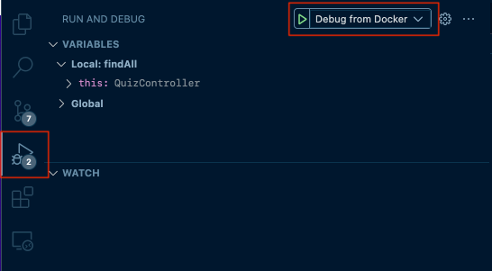

<p align="center">
  <a href="http://nestjs.com/" target="blank"></a>
</p>

<p align="center">A progressive <a href="http://nodejs.org" target="_blank">Node.js</a> framework for building efficient and scalable server-side applications.</p>

## Run with Docker
- Add `.env` file.
```shell
cp .env.example .env
```
- Create `docker-compose.yml` file.
```yml
version: '3.7'

services:
  app:
    image: ghcr.io/pnlinh-it/hello-nestjs:latest
    container_name: hello_nestjs
    ports:
      - "80:3000"
    env_file:
      - .env
    networks:
      - hello_nestjs
    depends_on:
      - mysql

  mysql:
    image: mysql:8.0
    container_name: mysql
    restart: unless-stopped
    environment:
      MYSQL_ROOT_PASSWORD: "${DB_PASSWORD}"
      MYSQL_DATABASE: "${DB_NAME}"
      MYSQL_PASSWORD: "${DB_PASSWORD}"
      MYSQL_ALLOW_EMPTY_PASSWORD: "true"
    networks:
      - hello_nestjs

networks:
  hello_nestjs:
    driver: bridge
    name: hello_nestjs    
```
- Start docker-compose
```shell
docker-compose up
```

## Debug
- Change `Dockerfile.dev`
```dockerfile
CMD ["npm", "run", "start:debug_docker"]
```
- Start docker-compose
```shell
docker-compose -f docker-compose.dev.yml up --build
```
- Waiting util container is running then start VS code debug.



- In case error module not found, remove `dist`, `node_modules` folder.